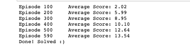
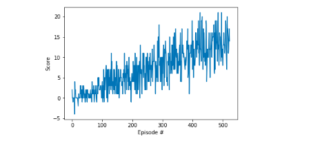

# Report document - Udacity Deep Reinforcement Learning Nanodegree: Project 1 - Navigation

## Project's Introduction
This project will train an agent to navigate (and collect bananas) in a large, square world.


A reward of +1 is provided for collecting a yellow banana, and a reward of -1 is provided for collecting a blue banana. Thus, the goal of your agent is to collect as many yellow bananas as possible while avoiding blue bananas. The state space has 37 dimensions and contains the agent's velocity, along with ray-based perception of objects around agent's forward direction. Given this information, the agent has to learn how to best select actions. Four discrete actions are available, corresponding to:

* 0 - move forward
* 1 - move backward
* 2 - turn left
* 3 - turn right.

The task is episodic, and in order to solve the environment, the agent must get an average score of +13 over 100 consecutive episodes.

## Project's environment
Based on [Unity ML-agents](https://github.com/Unity-Technologies/ml-agents), an open-source Unity plugin that enables games and simulations to serve as environments for training intelligent agents. Agents can be trained using reinforcement learning, imitation learning, neuroevolution, or other machine learning methods through a simple-to-use Python API.

## Project's code
All code used for this project is contained in the **Jupyter Notebook** named _Navigation.ipynb_,  project requirements are provided in the _README.md_ file, the code used for the model is included in _model.py_ and the code used for the training is provided in _dqn_agent.py_ The code used is based on the _Lunar Lander_ exercise provided in the _Udacity Deep Reinforcement Learning Nanodegree_.

## The deep Q-network (DQN) algorithm
For this project is used the [deep Q-network (DQN)](https://deepmind.com/research/dqn/), a value based method which combines reinforcement learning with [Q Learning](https://en.wikipedia.org/wiki/Q-learning) and a deep neural network aimed to learn a Q-table approximation.

### Parameters

```
STATE_SIZE = 37        
ACTION_SIZE = 4         
RANDOM_SEED = 40        
```

### Results




My solution is able to reach an average reward (over 100 episodes) of at least +13 in around 590 episodes, meeting the project's specifications.

### Future improvements
In order to improve the performarce of our agent it would be great to implement a [Double DQN](https://arxiv.org/abs/1509.06461), [Dueling DQN](https://arxiv.org/abs/1511.06581) and/or a [Prioritized experience replay](https://arxiv.org/abs/1511.05952).
